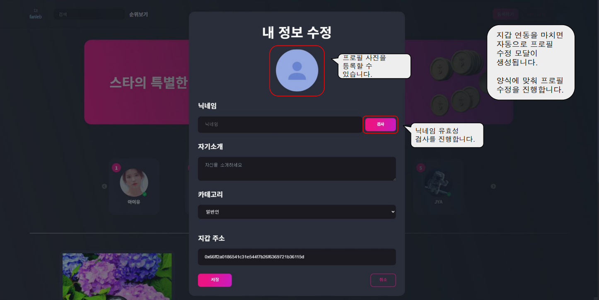

# Fanleb:zap:

- 프로젝트 기간 : 2022. 02. 21~ 2022. 04. 08 (약 6주)
- 팬과 스타를 연결하는 NFT 기반 구독형 컨텐츠 플랫폼
- 아티스트가 올린 사진, 동영상, 파일등을 NFT로 발행

## 목차 📄 

##### ✔ 팀 멤버

##### ✔ 사용 기술

##### ✔ 프로젝트 진행 기록

##### ✔ 서비스 내용

## 팀 구성 👨‍👩‍👧‍👧 

|   멤버 이름    | 멤버 역할  | 개발 내용                                                    |
| :------------: | :--------- | ------------------------------------------------------------ |
| 홍종규 (팀장)  | BlockChain | ERC721,20 설계 및 구현, Besu네트워크 활용, 메타모스트 지갑연동, web3이용 거래시스템 개발 |
| 최정민 (팀원)  | BackEnd    | 구독 정보 및 거래 정보 DB관리, 구축, 백엔드 전반적인 모든 개발 |
| 안재영  (팀원) | FrontEnd   | NFT 구독 서비스 구성 및 스마트컨트랙트와 프론트엔드 연결 및 전반적인 페이지 구성 |
| 박종선 (팀원)  | FrontEnd   | FrontEnd 전반적인 레이아웃, 페이지 구성 및 디자인            |
| 박찬혁 (팀원)  | BlockChain | 발표자료 작성 및 시연 시나리오 구성                          |

## 사용 기술 🖱 

## 프로젝트 진행 기록 ✏

- #### 협업툴

  

  

* 전체일정

  

## 서비스 내용 👐

* 메인 페이지

  

* 프로필 수정 모달

  

* 지갑 연동 후 메인페이지

  

* NFT등록 페이지

  

  

* 컬렉션 생성 모달

  

* 구독권 발행 모달

  

* 세부페이지

  

* 검색 결과 페이지

  

* NFT 상세 페이지

  

* 컨텐츠 페이지

  

